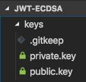

# JWT using ECDSA

Proof of concept script to demonstrate asymmetric signing using Elliptic Curve Digital Signature Algorithm (ECDSA).

Check out the [working demo](https://jwt-ecdsa-poc.herokuapp.com/)! 👯

## Overview

1. Generate a private-public key pair signed using elliptic curve cryptography (ECC) algorithm ECDSA
2. Use the private key on the back-end to sign your token
3. Use the public key on the front-end to verify your token and read the data

## Generating keys

Run the following commands in a Unix shell to generate your private and public key pairs:

    openssl ecparam -name prime256v1 -genkey -out keys/private.key
    openssl ec -in keys/private.key -pubout -out keys/public.key

These commands are also in the executable file named `./generate_keys.sh`.

The keys will be generated in the `./keys` directory.

## Usage

Run the script which will output information into the console (`node index.js`):

    yarn example

This should print output in the console with your asymmetrically signed JWT and public key.

To see how it works, check out this file `./index.js`.

## Development

There are a few parts to this project:

- `index.js` will have the entire process outlined in a simplified way
- `demo`
    - `./server` has the server-side implementation
    - `./client` has the client-side implementation. The client app is a nested repository (Vue.js app)

## Deployment

Deployed to Heroku:

    git push heroku master

## Further reading

- [ECDSA: The digital signature algorithm of a better internet](https://blog.cloudflare.com/ecdsa-the-digital-signature-algorithm-of-a-better-internet/) by Cloudflare
- [Seriously, stop using RSA](https://blog.trailofbits.com/2019/07/08/fuck-rsa/) by Trail of Bits
